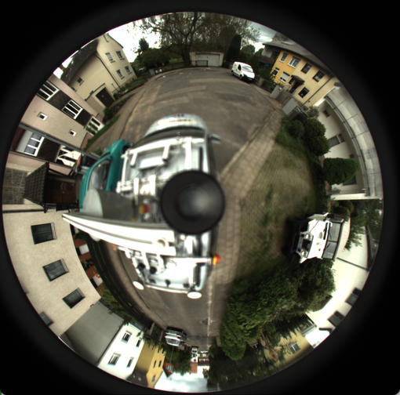
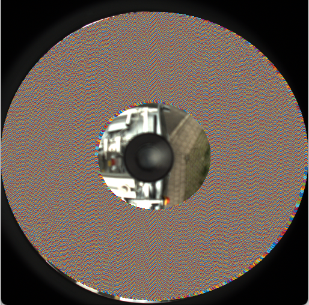
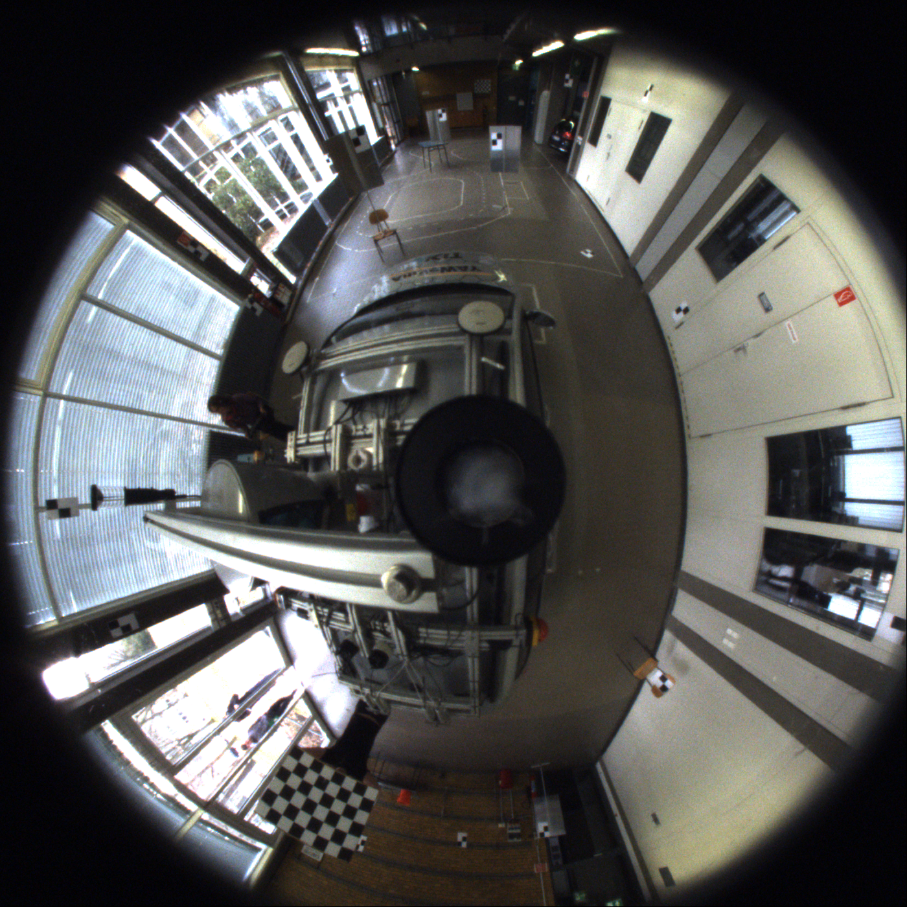
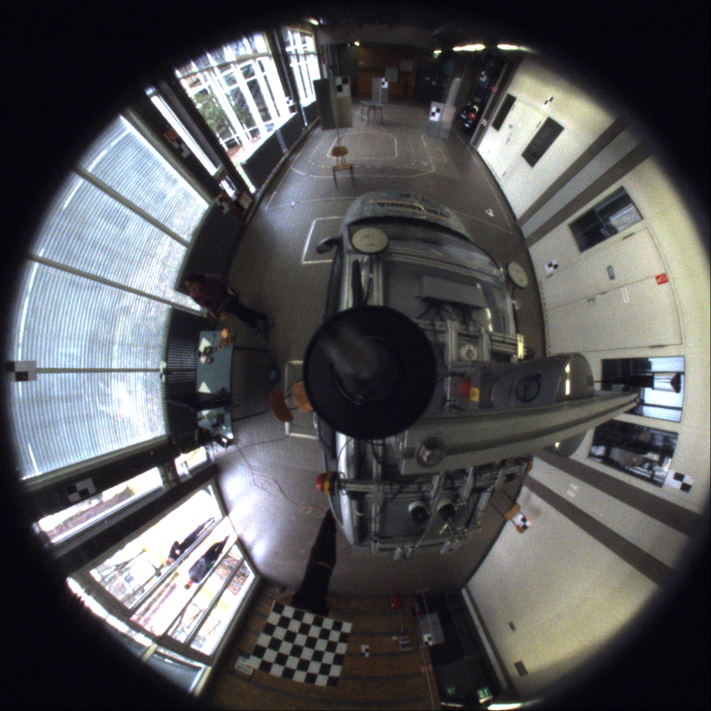
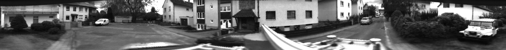
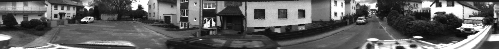
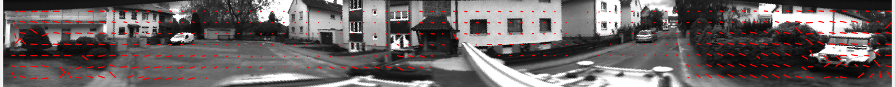

# Problem Statement
Finding the scene flow i.e. the motion vectors along the x, y, z axis for each pixel of the omnidirectional catadioptric image. 

# Importance
Catadioptric cameras are capable of providing a large field-of-view using a single lens and mirrors and have been shown to be used for recovering optimal 3D geometry, reflectance, texture etc. Larger field-of-view  property of catadioptric cameras motivates their usage for 3D motion sensing with potential applications towards autonomous vehicles, VR etc. 

# Approach
We propose a simple yet novel solution that finds scene flow using the following four steps:
 - **Rectify catadioptric images to match conventional camera images:** For this step we, first, find the area of interest in the catadioptric images and store the required image points in a lookup table for faster processing for other images in the dataset. Second, we calculate the height and width of the unwarped image. Finally, we reshape the lookup table points to the size of the unwarped image. The shaded region in the below image shows the area of interest - 
 
 
 - **Detect optical flow:** In this step we find the motion vectors along the x and y direction axis using Lucas-Kanade using two left stereo frames of unwarped catadioptric images.
 - **Estimate depth using disparity maps on stereo pair:** At this step, we are left with calculating the motion along the z direction. For estimating this motion vector, we calculate the disparity maps using Semi Global Block matching for a pair of unwarped catadioptric stereo images at time t=0 and t=1. The difference of these two disparity maps gives us the motion vector along the z-direction.
 - **Combine depth estimation and optical flow to estimate scene flow:** Finally, in this step we combine the optical flow with the depth estimation and estimate the final scene flow.

# Dataset
We used the libomnistereo dataset of size 78GB that was created by the Autonomous Vision Group (part of the University of Tübingen and the MPI for Intelligent Systems). Below is the example of a pair of catadioptric stereo images from the dataset.
 - **Original Left Catadioptric Stereo Image**
 
 - **Original Right Catadioptric Stereo Image**
 

# Results
 - **Left Unwarped Catadioptric image**
 
 - **Right Unwarped Catadioptric image**
 
 - **Disparity Map for unwarped stereo pair at t=0** 
 
 - **Disparity Map for unwarped stereo pair at t=1**
 
 - **Optical Flow for the left unwarped catadioptric image frames**
 
 - **Flow**
 
 
# Learning, Setbacks, and Future Work
 - **Learning:** We learnt about the different types of catadioptric cameras and how do they operate, unwarping catadioptric images, optical flow and depth estimations using disparity maps, and how do existing scene flow algorithms work.
 - **Setbacks:** We tried generating synthetic catadioptric images using POV-Ray but we were unable to map the ray equations to display the omnidirectional view of the objects.
 - **Future Work:** In future, we plan to tweak parameters and enforce smoothness using regularization to obtain better disparity maps. Also, develop a scene flow algorithm that works without unwarping catadioptric images.
