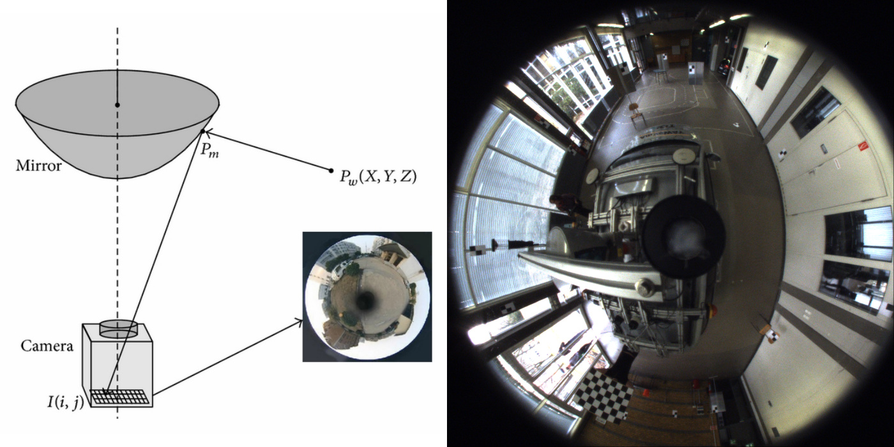
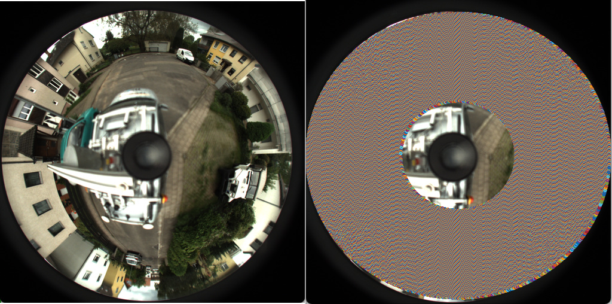
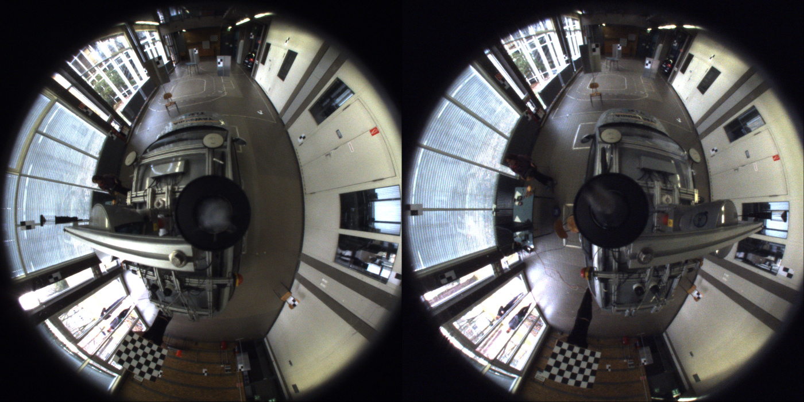

# Problem Statement
Finding the scene flow i.e. the motion vectors along the x, y, z-axis for each pixel of omnidirectional catadioptric images. 

# Importance
 - Catadioptric cameras are capable of providing a large field-of-view using an arrangement of a single lens and mirror(s). They have been shown to be used for recovering optimal 3D geometry, reflectance, texture etc. **but have not been used for estimating 3D motion till date**. 
 - Larger field-of-view  property of catadioptric cameras motivates their usage for 3D motion sensing with potential applications towards autonomous vehicles, VR etc. 

# Introduction
 - **Catadioptric Cameras:** Catadioptric cameras are cameras that combine mirror (usually curved) with conventional lens-based cameras to acquire wide fields-of-view. We have used a spherical mirror setup, as shown in the figure to the left, and its corresponding real-world captured image is shown in the right image.
 
   
 - **Scene Flow:** Scene flow captures the 3D motion field vectors of points in the real world just like optical flow captures the 2D motion field vectors.

# Approach
We propose a simple yet novel solution that finds scene flow using the following steps:
 - **Rectify catadioptric images to match conventional camera images:** For this step we, first, find the area of interest in the catadioptric images and store the required image points in a lookup table for faster processing for other images in the dataset. Second, we calculate the height and width of the unwarped image. Finally, we reshape the lookup table points to the size of the unwarped image. The shaded region in the image below shows the area of interest - 
 
    
 - **Detect optical flow:** In this step we find the motion vectors along the x and y-direction using Lucas-Kanade using two left stereo frames of unwarped catadioptric images.
 - **Estimate depth using disparity maps on a stereo pair:** At this step, we are left with calculating the motion along the z-direction. For estimating this motion vector, we calculate the disparity maps using Semi-Global Block matching for a pair of unwarped catadioptric stereo images at time t=0 and t=1. The difference between these two disparity maps gives us the motion vector along the z-direction.
 - **Combine depth estimation and optical flow to estimate scene flow:** Finally, in this step, we combine the optical flow with the depth estimation and estimate the final scene flow.
 - **Testing on exisiting scene flow detection algorithms:** We also tested existing scene flow detection algorithm (object scene flow) with these unwarped images to determine how well they work. This also allows us to make use of the existing state-of-the-art scene flow detection algorithms that were designed for conventional stereo images.

# Dataset
We used the libomnistereo dataset of size 78GB that was created by the Autonomous Vision Group (part of the University of Tübingen and the MPI for Intelligent Systems). Below is the example of a pair of catadioptric stereo images from the dataset.
 - **Original Left and Right Catadioptric Stereo Images**
 
 

# Results
 - **Left Unwarped Catadioptric image:** This image was generated by rectifying the left catadioptric stereo image.
 
 
 - **Right Unwarped Catadioptric image:** This image was generated by rectifying the right catadioptric stereo image.
 
 
 - **Disparity Map at t=0:** This map was generated using the stereo pair of the rectified catadioptric images at time t=0. 
 
 
 - **Disparity Map at t=1:** This map was generated using the stereo pair of the rectified catadioptric images at time t=1. 
 
 
 - **Optical Flow for the left unwarped catadioptric image frames:** Estimated using the frames at t=0 and t=1.
 
 
 - **Flow**
 
 
 - **Using existing scene flow detection algorithm (Object Scene Flow):** We supplied OSF with our rectified catadioptric images and wanted to know how well does existing scene flow algorithms work. We found that OSF produced better results as compared to our simple scene flow detection technique, however it takes around 10 minutes to find the scene flow whereas our simple approach takes approximately 40 seconds. This shows that although traditional scene flow detection algorithms work well on the unwarped images, they can't be extented to real time processing. 
 - **Interpretation of Results:** This simple approach shows that scene flow detection is possible on catadioptric images. However, our approach, involving unwarping the catadioptric images, leads to a loss which doesn't provide results with high accuracy. In order to avoid this, we would need to develop a novel scene flow algorithm that works directly on catadioptric images to detect scene flow.
 
# Learnings, Setbacks, and Future Work
 - **Learnings:** We learned about the different types of catadioptric cameras, unwarping catadioptric images, optical flow and depth estimations using disparity maps, and how do existing scene flow algorithms work.
 - **Setbacks:** We tried generating synthetic catadioptric images using POV-Ray but we were unable to map the ray equations to display the omnidirectional view of the objects.
 - **Future Work:** In the future, we plan to tweak parameters and enforce smoothness using regularization to obtain better disparity maps. Also, we want to develop a scene flow algorithm that works directly on catadioptric images without then need the unwarp.
